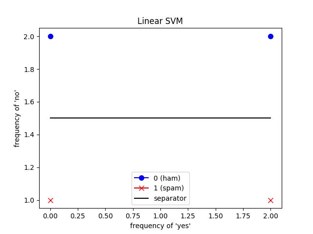
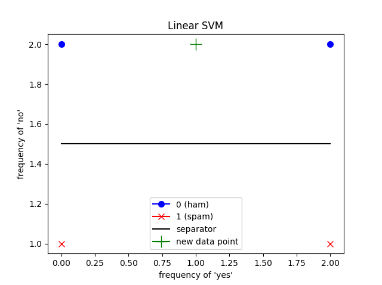
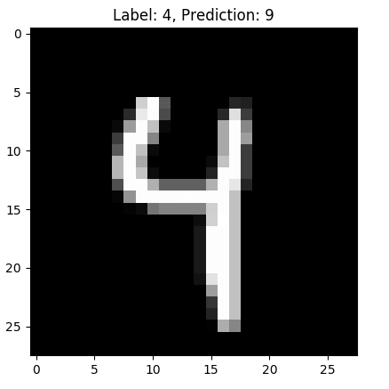

# Course in machine learning (ML)
A simple introduction to text classification with machine learning. The course
will cover some elementary linguistic morphology techniques for extracting
features, and an introduction to some classifiers.

The tasks in this course will be solved in **Python 3** with the
**scikit-learn** tool.

__Tasks__:
1. Creating a spam-filter
2. Sentiment analysis of movie reviews

> **Prerequisites**: Some *Python*

### Document classification/categorization
The process is to assign a document to one or more classes or categories. The
documents may be texts, images, music, etc. One of the most common types of
document classification is text classification.

* **Content-based** classification is classification in which the weight given
  to particular subjects in a document determines the class to which the
  document is assigned. It could be the number of times given words appears in a
  document.
* **Request-oriented** classification (or indexing) is classification in which
  the anticipated request from users is influencing how documents are being
  classified.

### Linguistic morphology 
Before we can use the data set, we have to extract the features we want to use.
There are several ways to extract these features. Some normal techniques are:

1. **Tokenization** is the process of delimiting a string of input characters. 
    The resulting tokens are then passed on to some other form of processing.  
    E.g. `The quick brown fox jumps over the lazy dog => [the, quick, brown, fox,
    jumps, over, the, lazy, dog]`
2. **Stemming** is the process of reducing inflected (or sometimes derived) words 
    to their word stem, base or root form.  
    E.g. `cats, catlike, catty => cat`, or the special form where the stem is not
    itself a word `argue, argued, argues, arguing => argu`
3. **Lemmatization** is the process of grouping together the inflected forms of a 
    word so they can be analysed as a single item, identified by the word's lemma,
    or dictionary form.  
    E.g. `am, are, is => be`
4. Removing **stop words** is a way to remove irrelevant data. Any group of words
    can be chosen as the stop words for a given purpose. This means that stop 
    words are the words that don't provide any context for the given task at hand.  
    E.g. `a, and, as, at, in, the`
5. The **bag-of-words** (BoW) model is used to look at the frequency of each word
    in a document. All words in the corpus (text samples) form a dictionary.  
    E.g.: The vocabulary `["John", "likes", "to", "watch", "movies", "Mary", "too",
    "also", "football", "games"]` applied to the text `John likes to watch movies.
    Mary likes movies too.` will form the vector `[1, 2, 1, 1, 2, 1, 1, 0, 0, 0]`.
6. **n-gram** is another probabilistic model. Instead of counting the frequency of 
    words, as in BoW, one counts sequences of *n* words.   
    E.g.: If one would like to extract the vocabulary from `Cats dance funny on 
    the Internet.`, it would result in:  
    2-gram: `['Cats dance', 'dance funny', 'funny on', 'on the', 'the Internet']`   
    3-gram: `['Cats dance funny', 'dance funny on', ' funny on the', 'on the Internet']`

### Choosing the right estimator
We want to make a model that predicts a class for different text examples. For
simplicity we have chosen data sets with binary classification (e.g. spam/ham).

For choosing the right estimator we can use scikit's estimator chooser:


### Example: BoW and Linear SVM

Vocabulary: `['yes', 'no']`   
Messages: `["yes no yes no", "no yes yes", "no", "no no"]`   
Labels: `[0, 1, 1, 0]`

#### Feature extraction
`"yes no yes no"` &rarr; `[2, 2]`  
`"no yes yes"` &rarr; `[2, 1]`  
`"no"` &rarr; `[0, 1]`  
`"no no"` &rarr; `[0, 2]`

#### Fitting the linear SVM model
Since we only have to features (frequency of 'yes' and 'no'), the linear SVM only has
two dimensions.



#### Classifying
We get the sentence `"no yes no"`, and transforms it with Bow. This results in `[1, 2]`.

The prediction will then be as follows:  


As we can easily see, this sentence will get classified as `0` (ham).

## Setup
Please clone (`git clone`) or download this repo before you do anything else.

If you need a decent IDE for python (no IDE wars please), get the [Pycharm
Community Edition](https://www.jetbrains.com/pycharm/).

If you already have some of the necessary requirements please make sure they are
up to date. This course was designed and tested with python 3.6. 3.5 will not
work.

### Windows
[Install Anaconda](https://www.anaconda.com/download/#download).

All you need to complete these tasks is included with Anaconda. Some of the code
may require the latest version of Anaconda, so please re-install or upgrade if
you are on an old version.

If you are using pycharm, it would now be a good idea to set the python
interpreter from anaconda as the [project
interpreter](https://www.jetbrains.com/help/pycharm/project-interpreter.html).

### Linux/MacOS
Install Python 3.6.

To install the requirements simply install them with `pip`.
```bash
pip3 install -r requirements.txt
```

Or if you want to install them locally in a virtual environment, do the following;
```bash
python3 -m venv env
source env/bin/activate
pip install -r requirements.txt
```
> **Note:** you may have to install `venv` separately.

If you are using pycharm, it would now be a good idea to set the [project
interpreter](https://www.jetbrains.com/help/pycharm/project-interpreter.html) to
either the global python install, or if you installed in virtual environment,
set it to `env/bin/python`.

## Tasks
Execute the `main.py` script with `python main.py`.

If you are getting an error here like `No module named 'sklearn'`, make sure you
are running it with the python install/environment we set up earlier. If it
still fails go back to the setup part or get help from an instructor.

### 1. Spam filter
file: [spam_filter.py](tasks/spam_filter.py)

In this task we are going to classify a SMS as either spam or ham. The data set
is labeled with 0 (ham) and 1 (spam). To better understand all the steps of
creating and validating a classifier we are going to:

1. Split the data into testing and training sets.
2. Extract features from the test data.
3. Train the classifier.
4. Verify that the classifier can tell the difference between spam and ham on
   unseen data.

__Data set__:

Have a look at the data in the [sms csv file.](files/spam_data/sms_source.csv),
can you identify some words that occur more often in the spam? Do not click any
links in the text. They are spam, and may be bad for your health.

Spam | SMS
---- | ----------------------
0    | Fair enough, ... 
1    | Did you hear about ...

#### 1a) Loading and splitting the data.

In order to validate that the classifier is unbiased and able to make accurate
predictions after the training phase we have to train it on one part of the
data, and test it on another.

Generally this is done by first shuffling the data-set, so that we avoid any
bias in the ordering of the data followed by slicing on some index determined by
how big each set should be.

Your job is to implement the function `split_and_shuffle_data_set`. It takes the
data as an array of strings and the labels as an array of ints.

You can do this however you would like, but it could be a good idea to use
sklearns
[shuffle](http://scikit-learn.org/stable/modules/generated/sklearn.utils.shuffle.html)
function and list slicing.


#### 1b) Feature extraction: transforming the text messages from text to vectors.

Next we are going to extract features from the data. Mainly there are two
important things to keep in mind here:
* Most ML algorithms require that we describe each data point as a vector of
  numbers.
* What features we extract will ultimately determine what the algorithm is
  capable of learning. Here we are going to make a simple count vectorizer with
  no added magic. This is a word bag model, and the predictor will therefore
  only be able to infer things from what words are present, not the structure of
  the sentences themselves.
  
A boolean vectorizer works by creating a vector for each document describing what words are present.
For instance: given the training documents: ['a b c', 'c d'] and the test document ['a d e'] we want to transform them 
like so:

Document  | Vector [a, b, c, d]   | Train?
--------- | --------------------- | ---------
'a b c'   | [1, 1, 1, 0]          | Yes
'c d'     | [0, 0, 1, 1]          | Yes
'a d e'   | [1, 0, 1, 0]          | No

There is no 'e' in the output vector because the transformer is not shown the test data when it is fitted.

In order to complete this task we are going to implement the missing methods in
the class `SMSFeatureExtractor`. It follows the sklearn `transformer` contract
with a `fit` method and a `transform` method. Here we want you to make your own
transformer, but later it would be smart to use one already
[included](http://scikit-learn.org/stable/data_transforms.html) with sklearn.


You should start with the `fit` method, and then tackle the `transform`.

The goal of the `fit` method is to prepare the transformer so that it is ready to `transform` any given document.
Here, it would be useful to store a representation of all the words in the data-set. We recommend trying a simple sorted
list of words. The `string.split()` method could be useful here.

The `transform` method should take in the string you created and create a vector like the one you can see in the table above.

A good place to start is to loop over the words in the vocabulary we saved in `fit` and adding a 1 to a list if it is
present in the string, and a 0 if it is not.

#### 1c) Choosing and training a classifier

Ok, time to get to the machine-*learning* part.

We have set up a really stupid classifier for you. It only counts the most
commonly occurring label and predicts that for any given input.

You can drop in any classifier you want already shipped with sklearn, such as
[LinearSVC](http://scikit-learn.org/stable/modules/generated/sklearn.svm.LinearSVC.html),
or you can try to implement a simple one like [k nearest
neighbours](https://en.wikipedia.org/wiki/K-nearest_neighbors_algorithm) in
place of the one we gave you.

#### 1d) Evaluating the classifer. Did we separate the spam from the ham?

If everything went smoothly you should see a _classification report_ and a
_confusion matrix_ in the output. The scores obviously depend on how well your
classifier performed.

The _confusion matrix_ is the simplest to interpret. The first index tells us
what label a given example had, and the second what we predicted it to be.
`[0][0]` is the true negatives (normal messages we allowed to pass), `[1][1]`
the true positives (spam we found) and so on.

The _classification report_ consists of three measures for each class, and one
average:
* Precision: When we say that something is a given class, how often are we
  right?
* Recall: Out of all the test examples with that given label, how often many did
  we correctly identify?
* f1-score: A combination of those two scores. (2 * precision * recall /
  (precision + recall))

As soon as these look good, at least above 0.9, you can feel confident that you
have made a decent spam filter and move on to the next task.

### 2. Sentiment analysis of movie reviews
file: [sentiment_analysis.py](tasks/sentiment_analysis.py)

The data set includes multiple columns. For a simple binary classifier we could
use the positive/negative label, but that is too easy. We are going to predict
the exact score of the review. Here we are going to measure how well you are
doing with Root Mean Squared Error. RMSE is a measure of how much, on average,
your predictor is missing the target score.

As we did in the last task we _could_ use a _classifier_. However, this would
then be a so-called multiclass classification problem. If we instead want make
use of the fact that the problem is predicting a score on a linear scale it
would be smart to instead think of this as a regression problem. There are
examples of _regressors_ in the model selector we looked at earlier.

Instead of providing you with all the glue code you are going to build a
pipeline. Think of a pipeline as a chain of transformers that mold the data,
followed by an estimator that learns and predicts based on the earlier
transformers. Pipeline docs for the curious:
[docs](http://scikit-learn.org/stable/modules/generated/sklearn.pipeline.Pipeline.html).

We have given you a simple starting pipeline with a dummy transformer and
regressor. Feel free to change those as you see fit, or use the transformers and
estimators provided by scikit learn.

__Data set__:

You can have a look at the data in the [review csv
file.](files/review_data/review_source.csv).

Positive | Rating | Review 
-------- | ------ | ----------------------------------------- 
1        | 10     | A nicely done thriller with plenty of ... 
0        | 2      | This film just goes around in circles ...

As soon as you are happy with the results (this is very individual, but try to at
least get below 3) you can move on to the next task :)

## Extra tasks
Execute the `extra.py` script with `python extra.py`.

### 1. Number classification
file: [number_classifier.py](tasks/number_classifier.py)

In this extra task we want to classify bitmaps to numbers. Each bitmap is
represented by a 1d-array. When you are done with all subtasks, you will 
get printed the wrongly classified numbers.

As seen here:   


You can then try to optimize your solution. The steps closely resemble 
the steps in main task 1.

#### a) Splitting the data

In this task we want to split the data set into training and test set. 
> **Note:** return data in correct order.

#### b) Fit feature extractor

If you want to store some relevant information about the data set do 
that here, if not; just return `self`.

#### c) Transform data
 
Transform the bitmaps to wanted representation, and return a numpy array.

#### d) Training estimator

Choose an estimator (or make your own), and train it with the transformed
training data.

## Finishing notes
Awesome! You are through the tasks. If there is still time left in the course
raise your hand and ask for some more to do.

If you prefer not talking to us, go back to task 1 and implement the KNN
estimator yourself, or keep improving the score in task 2. 
